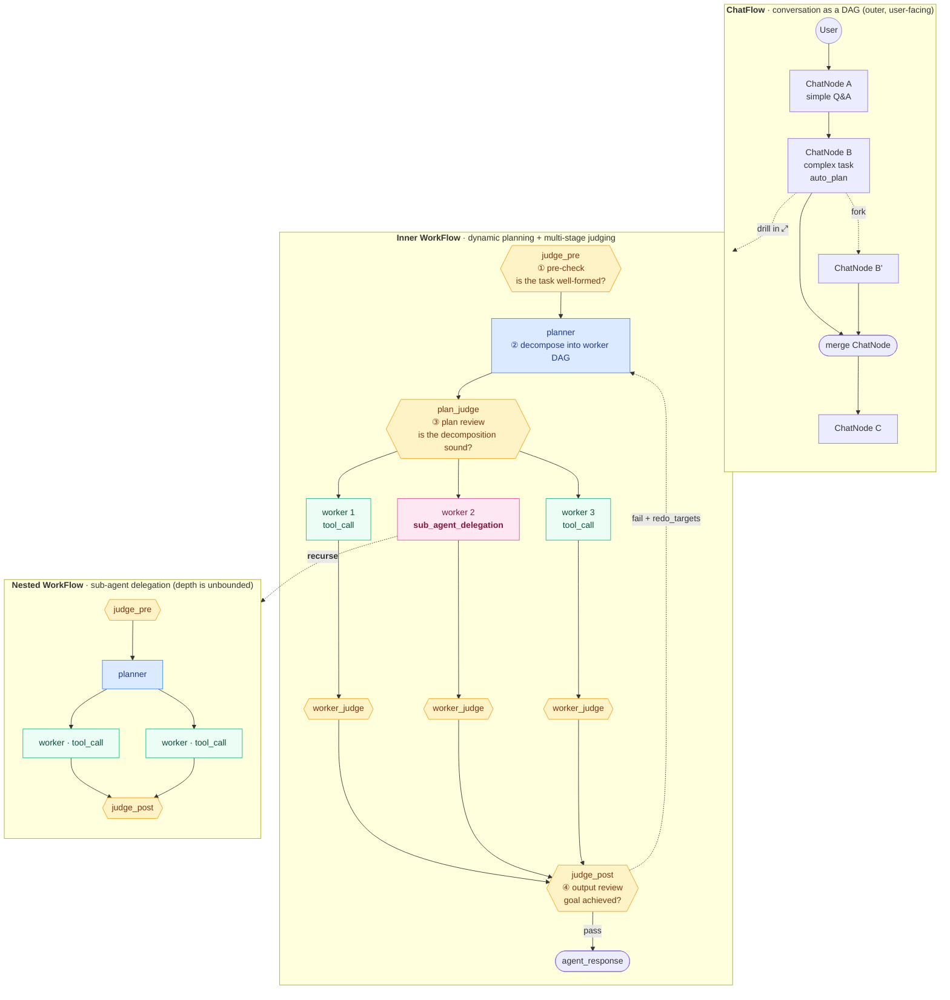

**English** | [中文](./README.md)

# Agentloom

> **⚠️ Work-in-progress.** Agentloom is in rapid iteration — milestones land daily,
> APIs shift, rough edges are expected. Treat what you see as a snapshot of an
> active prototype, not a finished product. The devlog at the bottom is the
> authoritative record of what changed and why.

**Agentloom is a visual agent workflow platform where every conversation is a
branchable, forkable, mergeable DAG and every agent step is inspectable.**
Instead of a linear chat log or a hand-wired pipeline, the conversation itself
is a graph you can fork, merge, compact, and replay — with a dynamic planner
that decomposes goals into sub-tasks as it goes.


---

## Why it's interesting

Most "agent" UIs degenerate into one of two things: a linear chatbox, or a
pre-wired static workflow. Agentloom tries to do both at once, and adds a
third axis: **the conversation is the workflow**, and the workflow is a
first-class DAG the user can edit.

Concretely, that means:

- **Multi-thread conversation.** Any ChatNode can be forked — you get a new
  branch that shares history up to the fork point and diverges from there.
  Branches run in parallel, independent of each other. There's no "current
  chat session" — there are as many live threads as you want.

- **Merge.** Two branches that explored different strategies can be folded
  back into a single node whose reply reconciles both. Downstream turns
  continue from the merged conclusion. Fork / merge together turn the chat
  tree into a DAG rather than just a tree.

- **Compact.** Long conversations are summarized into a compact ChatNode at
  either ChatFlow level (explicit, user-visible) or WorkFlow level (implicit,
  triggered before an llm_call that's about to overflow the context window).
  Both tiers dogfood the same `compact.yaml` template — compaction is a
  reusable workflow, not a hardcoded engine action.

  

- **Dynamic planner + nested workflows.** Each ChatNode has an inner WorkFlow
  DAG: model calls, tool calls, sub-agent delegations, judges. For complex
  goals the planner decomposes the task into a DAG of WorkNodes, executes
  them in parallel where possible, and judges the output at each phase
  (pre / during / post). Sub-agent delegations spawn nested WorkFlows with
  their own event stream forwarded up to the parent.

  

- **Plan / Execute separation.** Every node has two phases: dashed (planned,
  editable) → solid (executed, frozen). You can edit the plan before it
  runs, inspect the execution afterwards, and iterate by branching —
  nothing is overwritten.

- **Full observability.** SSE event stream surfaces every engine transition
  to the canvas. Usage, latency, token counts, judge verdicts, retry state
  are all visible per node. Node IDs, model metadata, and tool call args
  are exposed so you can understand *why* the agent did what it did.

---

## Architecture · how a request decomposes



**How to read it:**

1. **ChatFlow layer** is the user-facing conversation. Simple questions fit
   in a single ChatNode; complex tasks get an `auto_plan` ChatNode with its
   own inner WorkFlow. Forks, merges, and compaction all happen at this
   layer.
2. **WorkFlow layer** is the agent's internal problem-solving DAG. From a
   single ChatNode, **judge_pre** first checks that the task is
   well-formed (and asks the user / fills in missing inputs if not). Then
   **planner** decomposes it into a DAG of workers. **plan_judge** reviews
   whether that decomposition is sound.
3. **Parallel execution**: once the plan passes, sibling workers run
   concurrently. `tool_call` workers hit tools directly;
   `sub_agent_delegation` workers recursively spawn a nested WorkFlow —
   depth is unbounded, and each level has its own pre / plan / post judge
   trio.
4. **Converging review**: each worker's output is first gated by its own
   `worker_judge`, then **judge_post** renders the final verdict on
   whether the original goal was met. Failure doesn't re-run the whole
   workflow — `redo_targets` replays only the affected sub-tree.

One principle ties it all together: **every judge, planner, compact, and
merge is itself a WorkFlow fixture**, not engine-special logic. That means
the prompts for the three-stage judge, the planner's decomposition
strategy, and the retry criteria are all YAML templates the user can
inspect and swap out.

---

## Core concepts

| Concept | What it is |
|---|---|
| **ChatFlow** | The outer DAG. Nodes are `ChatNode`s — a user-turn / agent-turn pair, or a special compact / merge node. Edges are `parent_ids`. Branching = new ChatNode with the same parent. |
| **ChatNode** | One turn in the conversation. Holds a `user_message`, an `agent_response`, and an *inner* WorkFlow that produced the response. Can also be a compact or merge node. |
| **WorkFlow** | The inner DAG. Nodes are `WorkNode`s representing a unit of agent work. |
| **WorkNode** | One of `llm_call` / `tool_call` / `judge_call` / `sub_agent_delegation` / `compact` / `merge`. Solid once executed (frozen, immutable). |
| **Planner** | A recursive decomposer that expands an auto-plan ChatNode into a WorkFlow DAG, with judge_pre / judge_during / judge_post checkpoints. |
| **MemoryBoard** | Each ChatNode / WorkNode emits a brief (short description + source_kind + source node id), collected into the ChatBoard / WorkBoard. Downstream consumers (judge, compact, `get_node_context`) recall originals by id. |
| **Execution mode** | Per-node selector: `native_react` (single ReAct loop) / `semi_auto` (explicit plan phase, one pass) / `auto_plan` (recursive planner with judge-driven retry). |

---

## Features shipped so far

### Conversation DAG
- [x] Fork any ChatNode (right-click → "Branch from here")
- [x] **Merge two ChatNodes** into a synthesized reply (VSCode-compare-style
      two-step pick: "Select to merge" → "Merge with pending"; cancel on
      drag/escape/background-click). LCA-aware: the shared root→LCA prefix
      is fed once, only post-LCA branch suffixes get merged.
- [x] **Compact** conversation tier 1 (auto, pre-llm_call) + tier 2 (manual
      or auto, ChatFlow-level). Reusable compact template, visible snapshot
      with preserved tail.
- [x] Joint-compact: when both branches of a merge overflow the budget,
      a visible joint-compact ChatNode materializes between the sources
      and the merge node instead of silently pre-compacting each branch.
- [x] Retry / cancel / delete with cascade
- [x] Branch navigation (↑↓ siblings, jump to parent/child)
- [x] Multi-parent merge ChatNodes render as a confluence in the canvas

### WorkFlow engine
- [x] Three execution modes (`native_react` / `semi_auto` / `auto_plan`) —
      per-ChatFlow default + per-ChatNode override
- [x] Recursive planner with `plan.yaml` / `planner.yaml` / `planner_judge.yaml`
      templates; decompose → execute → judge → retry loop
- [x] Parallel sibling scheduling — ready WorkNodes in a layer run concurrently
- [x] Sub-agent delegation with nested WorkFlow + bubbled halts +
      forwarded SSE events
- [x] Judge trio (`pre` / `during` / `post`) with structured verdicts
      (JSON schema + forced tool-use defense-in-depth)
- [x] Ground-ratio fuse (halts WorkFlows that churn without tool_calls)
- [x] Retry budget + redo_targets (re-spawn + re-run affected sub-trees)
- [x] Tool-loop budget guard
- [x] Pending user-prompt — agent can explicitly ask the user a question
      mid-flow and pause; user reply resumes the workflow

### Context management
- [x] Context window lookup cache (per-provider / per-model, reads real
      metadata — Ark 131K, Anthropic 200K, etc.)
- [x] Compact trigger + target percent invariant (sum ≤ 100%)
- [x] Compact loop fuse (skips recursive compact-the-summary cascade)
- [x] Tagged context with per-ChatNode-id prefixes for compact worker citations
- [x] Structural citation + coverage fallback: when the compact/merge LLM
      forgets to cite source node IDs, the engine appends truncated raw
      tails for the uncited nodes so downstream context is never rootless
- [x] **MemoryBoard**: ChatBoard (ChatNode-level) + WorkBoard
      (WorkNode-level) brief indexes; judges, compact, and the reader
      skill recall originals by id
- [x] **Sticky-restore**: `get_node_context` hits pin the source node
      into the current ChatNode's `sticky_restored`; the pin decays
      per-turn down the chain, forks decay independently, merges take
      the per-source MAX, and the next compact leaves it intact
- [x] `inbound_context` segmented preview API: the ChatFlow right pane
      renders the context that the LLM is about to see as
      summary_preamble / preserved / ancestor / sticky_restored /
      current_turn segments so synthetic and real turns are visually
      distinct

### Providers + tools
- [x] OpenAI-compatible providers (Volcengine / Ark / Ollama / OpenAI)
- [x] Anthropic native (for Claude tool-use)
- [x] `provider_sub_kind` whitelist for per-provider sampling params
- [x] Per-call-type model overrides (judge / tool-call can use cheaper models)
- [x] Tools: Bash / Read / Write / Edit / Glob / Grep / Tavily search
- [x] MCP client (basic)
- [x] `get_node_context` skill — pull any ChatNode/WorkNode's context by id

### UX
- [x] React Flow canvas with sticky notes, compact badges, merge badges,
      awaiting-user highlight, active-work panel
- [x] **MemoryBoard floating panel** (bottom-right, shared across
      ChatFlow / WorkFlow canvases): lists every brief in the current
      flow; click an entry to jump the canvas to the source node
- [x] ChatFlow settings: execution mode, default / judge / tool-call /
      compact models, compact triggers, ground-ratio thresholds

  
- [x] ConversationView with compact / merge bubbles, token usage, copy,
      markdown rendering
- [x] i18n (en-US + zh-CN) — all fixture templates translated per locale
- [x] Structured JSON output (provider / model two-layer `json_mode`)

### Infra
- [x] Postgres (async SQLAlchemy) + Redis via docker-compose
- [x] Alembic migrations
- [x] SSE event bus with per-workflow subscriptions + nested forwarding
- [x] Hierarchical token-bucket rate limiting
- [x] Pytest: 385+ backend tests + 55+ frontend tests passing

---

## In development

Designed but not yet built (or only scaffolded):

- [ ] **Pack** — a Layer-1 WorkNode kind dual to `compress`: bundles a
      WorkFlow / ChatFlow's output into a deliverable artifact (document,
      code patch, structured report) so an agent's work product is a
      reusable asset rather than a scatter of nodes.
- [ ] **Cognitive-node ReAct DAG expansion** — planning / pre-check /
      monitoring / post-check WorkNodes will uniformly support ReAct-style
      DAG expansion (cognitive endpoints with tool_calls between them),
      riding with the MCP runtime (M7.5). The current stopgap is injecting
      a capability whitelist into planner prompts.
- [ ] **Judge deep-read skill** — `judge_post` cannot pull a sibling's
      full text on demand today. Bundle this as an explicit skill once
      MCP / skills land, and handle `tool_result` overflow fallback
      cleanly.
- [ ] **Engine actions as tool-use** — rewrite engine-produced actions
      like `planner.decompose` and `judge.verdict` as explicit
      `tool_call`s so they share the same schema / logging / blackboard
      write path as user and built-in tools. Revisit after the MCP
      runtime ships.

---

## Design philosophy

Three commitments drive most decisions:

1. **Immutable on execute, iterate by branching.** A node that has run is
   frozen. If you want to try a different approach, you fork — the previous
   attempt stays intact on the canvas. This makes every experiment
   auditable and makes "rewind" a first-class navigation primitive instead
   of a destructive edit.

2. **DAG > linear.** A real research session is not a single thread; it's
   multiple parallel lines of thought that occasionally converge. The tree
   of forks + the merge operator turn the canvas into a DAG where history
   is structural, not chronological. This is what enables parallel
   branches, cross-branch merge, and compact summaries that cite specific
   ancestor nodes.

3. **Engine actions are reusable plans, not hardcoded steps.** Compact,
   merge, judge, planner — each is a YAML fixture instantiated into a
   real WorkFlow, not a special case in the engine. Users can inspect
   and (eventually) modify these fixtures; the platform dogfoods its own
   primitives.

---

## Dev setup

```bash
cp .env.example .env
# Fill in VOLCENGINE_API_KEY, TAVILY_API_KEY, ANTHROPIC_API_KEY as available.

# Start postgres + redis
docker compose up -d postgres redis

# Backend (hot reload)
cd backend
pip install -e ".[dev]"
uvicorn agentloom.main:app --reload

# Frontend (separate terminal)
cd frontend
npm install
npm run dev
```

Health check: `curl localhost:8000/health` → `{"status":"ok","version":"0.1.0"}`
Frontend: `http://localhost:5173`.

## Tests

```bash
make test           # backend unit + integration
make test-smoke     # live API tests (requires env keys)
make test-e2e       # playwright
cd frontend && npx vitest run   # frontend unit
```

## Layout

```
backend/
  agentloom/
    api/          HTTP routes (chatflows, workflows, providers, settings)
    db/           SQLAlchemy models + async repositories
    engine/       WorkFlow + ChatFlow execution engines
    providers/    OpenAI-compat + Anthropic native adapters
    templates/    YAML fixtures (plan / planner / judge / worker / compact / merge / title_gen)
    tools/        Bash / Read / Write / Edit / Glob / Grep / Tavily / node_context
    mcp/          MCP client
    rate_limit/   Hierarchical Token Bucket
  alembic/        migrations
frontend/
  src/
    canvas/       React Flow canvas, ConversationView, node cards
    components/   Settings, dialogs, ribbons
    i18n/         zh-CN + en-US locales
    store/        Zustand stores (chatflowStore, preferencesStore)
tests/
  backend/{unit,integration,smoke,system}
  frontend/   (colocated `*.test.ts` under `src/`)
docs/
  devlog.md     <-- authoritative development log
```

## Status

Rapid-iteration MVP. Core ChatFlow/WorkFlow DAG + planner + compact + merge
have landed. See [`docs/devlog.md`](docs/devlog.md) for the full
development log — every milestone, every design tradeoff, every bug that
bit and how it was fixed.

---

## Development log

For the full narrative — design decisions, tradeoffs considered and
rejected, bugs discovered during integration, and the order in which
features landed — see:

**→ [`docs/devlog.md`](docs/devlog.md)**
