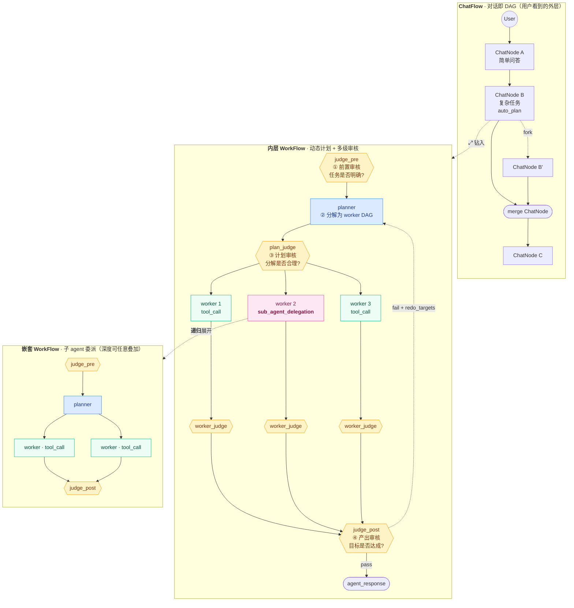

[English](./README.en.md) | **中文**

# Agentloom

**Agentloom 是一个可视化的 Agent 工作流平台：每一段对话都是可分支、可 fork、可 merge
的 DAG，每一步 agent 执行都可以被拆开查看。** 这里既不是线性聊天记录，也不是预先
手工连好的流水线——**对话本身就是一张图**，你可以 fork、merge、compact、回放；内置
的动态 planner 在执行过程中把目标拆解成子任务再递归下去。


---

## 🎯 一眼看 Agentloom（先总后分）

| 维度 | 数字 / 状态 |
|---|---|
| **核心能力** | ChatFlow DAG（fork/merge/compact/pack/fold）+ 嵌套 WorkFlow + 递归 planner + 三段式 judge + MemoryBoard + 跨 chatflow 数据访问门禁 |
| **执行模式** | `native_react`（直连 ReAct）/ `semi_auto`（一次性 plan）/ `auto_plan`（递归 planner + judge 驱动重试），ChatFlow 默认 + ChatNode 覆盖 |
| **WorkNode 类型** | `llm_call` · `tool_call` · `judge_call` (pre/during/post) · `sub_agent_delegation` · `compact` · `merge` · `pack` · `brief` |
| **测试覆盖** | 后端 **839** unit + integration（其中 **651** unit）/ 4 skipped；前端 **88** 单测；全部跑过 |
| **最近里程碑** | **M7.5 capability model**（2026-04-26 · 8 PR + 1 hotfix 单日 ship · ~1900 行 diff · ~100 新测试）+ **post-ship 修复 8 commit**（2026-04-26 night → 2026-04-27：auto_plan 死锁修复 / capability_request 反馈闭环履约 / drill-down nudge / 跨 chatflow 工具污染 fix / etc.） |
| **τ-bench retail 0-9 (NATIVE_REACT) baseline** | **8/10 = 80% pass^1**（agent: ark-code-latest via 火山引擎 coding plan lite · user simulator: doubao-seed-2-0-pro-260215 · 全程 ~27 min · 2 fail 归因到 user simulator 演 "private person" persona 拒验证而非 agent 错） |
| **provider 支持** | OpenAI 兼容（Volcengine / Ark / Ollama / OpenAI）+ Anthropic 原生 + MCP 客户端 |
| **i18n** | en-US + zh-CN 全套 fixture + 引擎熔断消息 |
| **持续运行** | docker-compose Postgres + Redis；orphan-sweep + watchdog；分层 token-bucket 限流；SSE 事件总线（嵌套转发） |

### 三句话讲清 Agentloom

1. **架构上**：每个 ChatNode 内嵌一个 WorkFlow——外层是用户视角的对话 DAG，内层是 agent 解题的 DAG。两层都是一等公民、都能被分支、合流、压缩、打包。
2. **执行上**：`auto_plan` 模式下 judge_pre → planner → planner_judge → 并行 worker → worker_judge → judge_post 全链可见，每个 cognitive 节点都对应一份可审视的 YAML fixture，不是 engine 里的硬编码逻辑。
3. **工程上**：执行即冻结，迭代靠分支；fixture 模板化的"engine 动作"自洽 dogfood（compact / merge / judge / planner 自己也是 WorkFlow）；plan/execute 分离让所有实验可审计。

---

## 🆚 递归式 DAG 分解 vs 传统 ReAct Loop

`auto_plan` 模式做的是**递归式任务分解 + 并行 worker DAG**，跟主流 agent 框架（LangChain / OpenAI Assistants / 多数 React-style agent）的**单循环 ReAct**是两条根本不同的路径。两者各有取舍，Agentloom 设计上同时支持（`native_react` 模式就是单循环 ReAct）。

### 对比表

| 维度 | 传统 ReAct Loop | Agentloom 递归 DAG |
|---|---|---|
| **执行结构** | 单一 LLM 循环：observe → reason → act → observe ... | judge_pre → planner → 并行 workers → judges → judge_post，每层都是独立 LLM 调用 |
| **上下文形态** | 单一线性 message 链不断膨胀 | 每个 sub-WorkFlow 只看自己的 trio（description/inputs/expected_outcome），父层上下文不传染 |
| **并行度** | 0（每步串行） | 同层 worker 一批并发跑（`asyncio.gather`） |
| **失败处理** | 整个 loop retry 或 halt | `redo_targets` 精确指定要重跑的子树，其它兄弟保留 |
| **可审计性** | 单条 trace；中间想法和最终决策混在一起 | 每个 cognitive 节点输出独立可见的 verdict（feasibility / plan / critique） |
| **模型分配** | 全程一个模型 | judge / worker / tool_call / brief 各自可指定不同模型（cheap judge + premium worker） |
| **per-turn 成本** | 低（~1-3 次 LLM 调用） | 高（5-7+ cognitive 节点 × per-turn） |
| **per-turn 延迟** | 低（~10-30s） | 高（auto_plan + 真实 task ~3-5 min/turn） |
| **长任务支撑** | 上下文爆炸（10+ 步后 message chain 撑不住） | 每个 worker 独立 context；compact 在 sub-tree 内 |
| **任务复杂度天花板** | 中等（深度分解会超出 context） | 高（递归深度由 `delegation_depth_budget` 控制，默认 2 层） |

### Agentloom DAG 路径的优点

1. **并行度直接落地**：planner 输出的 worker DAG 一旦同层就 `gather` 一起跑——一个"研究 3 个候选方案"的任务真的能 3 路并发查 + 3 路并发综合，时间约等于最慢的一路。ReAct loop 强行串行
2. **上下文不污染**：sub-WorkFlow 不继承父对话历史，只看 planner 给的 trio。这意味着深层子任务的上下文窗口永远新鲜，不会因为外层对话长度撑爆。Compact + Pack 也都在子树内做
3. **失败定位 + 部分聚合**：一个子任务失败时，`redo_targets` 让 judge_post 精确点名要重跑哪个 worker，已成功的兄弟保留。decompose group 里 partial 失败也可以聚合，给用户带具体失败原因的 halt message。ReAct 失败基本上只能整 loop retry
4. **多级审核 = 早 fail**：judge_pre 在 planner 之前 veto 不可行任务（不浪费 worker token）；plan_judge 在执行前 veto 烂分解（不浪费 sub-tree）；judge_post 在终态 veto 不达标产出。M7.5 的 catalog inject 让 judge_pre 提前发现"工具缺口"halt 整个 chain（实测 1 个 chatflow 4 个 worknode 就干净结束，零浪费 worker 调用）
5. **模型 cascade 经济性**：判官跑 cheap 模型（claude-haiku/doubao-lite），worker 跑 premium 模型（claude-sonnet/ark-code）。ChatFlow 设置 `default_judge_model` / `default_tool_call_model` / `brief_model` 各自指定。同样任务比单模型 ReAct 便宜 3-5×
6. **可审计 / 可复现**：每个 cognitive 节点都是独立 worknode，输入输出都冻结、可点击查看。fixture 是 YAML 模板，不是 engine 硬编码——同一个 chatflow 用同一份 fixture 重跑应该输出 byte-identical 的 trace（modulo 模型采样）

### Agentloom DAG 路径的缺点

1. **per-turn 成本和延迟高**：5-7 个 cognitive 节点 × per-turn 至少 5× 单 ReAct loop 的成本。短任务（"今天天气怎样"）走 `auto_plan` 是过度工程，平台默认这种走 `native_react`
2. **planner 决策质量是天花板**：分解错了下游全错。M7.5 catalog inject + extracted_inheritable_tools 给 planner 提供了"哪些工具真的可用"的事实约束，比之前的"凭训练数据猜"靠谱很多，但不能消除 planner 误判（如把"简单 lookup"误分解成 5 个 worker）
3. **弱模型不喜欢用复杂路径**：实测 claude-haiku + claude-sonnet 都倾向 atomic，少用 recon DAG 或 decompose——设计文档 §10.1.4 明确预测的"弱模型跳深路径"行为。需要 opus / GPT-4 级才能完整发挥
4. **debug 成本高**：单 ReAct loop 一条 trace 看到底；Agentloom 的 24 个 worknode 全展开是体力活。canvas 和 inbound_context 预览是为了缓解这个，但本质复杂度还在
5. **延迟不可压缩到对话级**：用户每发一句话等 3-5 min 是体验瓶颈。这条路径只适合"重思考、可异步"的任务（research、refactor、code review），不适合实时 chat

### 设计应对

Agentloom 的策略是**两条路径同时支持，由 ChatFlow 默认 + ChatNode 覆盖让用户/系统按场景选**：

- 简单问题、实时聊天 → `native_react`（默认）
- 复杂多步、研究分析、代码改造 → `auto_plan`
- 折中（已知步数、需要 plan 但不需要递归）→ `semi_auto`

`auto_plan` 节点的 ChatNode 卡片有专门的执行模式徽章，用户随时能看到"这个回答是用了 5 个 cognitive 节点 × 3 分钟换来的"还是"普通 1 LLM 调用 30 秒"，预期透明。

---

## 🚀 近期里程碑 · M7.5 capability model（2026-04-26 · 单日 8 PR ship）

把工具授权从 **chatflow-global allow/deny** 升级到 **per-WorkNode capability allocation**，让每个 cognitive / execution 节点都有自己的工具白名单，cognitive 节点自动只看 read-only 工具。设计文档：[`docs/design-m7.5-capability-model.md`](docs/design-m7.5-capability-model.md)。

### 8 PR 链（commit `aca3381..2fdcbf1`）

| PR | Commit | 内容 |
|---|---|---|
| 1 | `aca3381` | `Tool.side_effect` 元数据（NONE/READ/WRITE）+ MCP `readOnlyHint` 透传 |
| 2 | `6ccd27a` | capability schema：`WorkFlowNode.effective_tools` / `inheritable_tools` / `capability_request` + judge_pre 双栏输出 |
| 3 | `260cb19` | `ToolRegistry.resolve_for_node` 统一管线：chatflow_disabled + 节点白名单 + side_effect 过滤 + legacy ToolConstraints 折成单遍 |
| 4 | `2945d89` | catalog 注入 cognitive 节点 system envelope（`_compose_system_envelope`）：worker 看 runtime note，cognitive 看 note + `\n---\n` + 工具目录 |
| 5 | `efcdfc0` | `<capability_request>Bash, Write</capability_request>` worker 信号槽 + JudgeVerdict.capability_escalation |
| 6 | `44634dd` | planner `submit_plan` tool_use 路径（与 `judge_verdict` 对称） |
| 7 | `2fdcbf1` | cognitive ReAct DAG（judge_pre 可发 `recon_plan` 让引擎先跑读再判，opt-in） |
| 8 | `255b662` | `get_node_context` 跨 chatflow scope + 虚拟权限位（`Name.subcapability` 命名约定） |
| hotfix | `90b7f88` | 真模型 verify 时挖出 Anthropic schema validator bug（`tools.input_schema` 不接 top-level `oneOf`），改 Pydantic-flat 修复 |

### 实测 + 反哺设计

跑了 **3 个 auto_plan + cognitive_react 真模型 chatflow**（claude-haiku / sonnet）：
- ✅ judge_pre 真从 catalog 挑实名工具（`['Glob']` / `['Read']` / `['Read', 'Grep']`）写到 `WorkFlow.inheritable_tools`——M7.5 全栈管线在真模型下确认活跃
- ✅ submit_plan tool_use 路径跑通（hotfix 后），24 worknode 全 succeeded，judge_post=accept
- ⚠️ recon_plan 0/3 emit——sonnet 也归"弱模型"档（设计文档 §10.1.4 预测复现）
- 💡 **emergent finding**：PR 4（catalog inject）**前置吸收**了 PR 5（capability_request）的应用面——catalog 让 judge_pre 在工具缺口出现时**提前** halt，worker 根本没机会喊 capability_request。把这个观察反写回了设计文档 §10.5，并把"judge_during inject capability_request"这条 deferred 项降级为"先观察真实负载再决定"

### 关联工程实践亮点

- **cross-provider schema bug 是单测覆盖不到的——只有真 LLM 跑才暴露**：OpenAI/volcengine/ark 都接受 top-level `oneOf`，只有 Anthropic 拒。M7.5 PR 6 hotfix 同时新增 2 条单测把这个不变量钉死（`test_submit_plan_tool_use.py::test_tool_def_parameters_no_top_level_oneof_anthropic_compat`）
- **设计文档反哺**：post-ship 把实测发现写回 §10.1.4 / §10.3 / §10.5——记录"什么预测应验"和"什么 emergent property 没想到"。设计文档不是定稿后封存的合同，而是经验回路里活的部分
- **小步快跑**：8 个 PR 按依赖图拆分，每个独立可 revert + 自带测试。这种纪律来自之前一次大改踩的坑（memory `feedback_small_steps_strategy.md`）

---

## 🔧 Post-ship 修复 + 履约（commit `305b04a..fdfb1f2`）

M7.5 主链 ship 后跑实负载暴露了一批**问题域** + **设计文档承诺但没履约的 follow-up**，按 audit 优先级逐项闭环：

| Commit | 类别 | 修了什么 |
|---|---|---|
| `fdfb1f2` | 🔴 auto_plan 死锁 | **`submit_plan` leak 修复**：`_spawn_tool_loop_children` 不再把引擎合成的 `submit_plan`/`judge_verdict` 当真工具 spawn tool_call WorkNode。之前 auto_plan 每个 turn 都因这个 bug halt 在 planner 阶段，agent 误报"调用了不存在的工具" |
| `2f9998f` | 🟠 履约 PR 5 | **capability_request 完整反馈闭环**：worker emit → worker_judge 读 `worker.capability_request` 写 `JudgeVerdict.capability_escalation` → 引擎 widen `inheritable_tools` + spawn 新 planner。PR 5 commit msg 自己写了"consumers (re-plan / planner reset) land in a follow-up PR"，这次补完 |
| `458e5ee` | 🟡 drill-down 可靠性 | **系统层 nudge**：`get_node_context.description` 改 prescriptive；`_drill_down_nudge_if_needed` 在 chatflow 含 compact/pack 时自动注入 recall hint。弱模型 drill-down 触发率提升 |
| `bdedbdd` | 🟠 工具污染 | **foreign tau-bench tool filter**：`_foreign_tau_tools` 排除其它 session 的 `tau_*` 进自己的 catalog/disabled。M7.5 showcase chatflow 跑时被并发 tau session 工具污染的 bug 闭环 |
| `d3dd77a` | 🟡 可观测性 | **`input_messages = LLM 实际看到的内容`**：之前 fixture 预设 `input_messages` 的节点（judge / planner / brief）saved 是 pre-envelope 干净版，跟 wire 实际发送的不一致。canvas / inbound_context preview 现在跟 LLM 视角对齐 |
| `264ad2d` | 🟡 UX | **markdown GFM tables + inline HTML**：之前 `react-markdown` 默认只支持 CommonMark，模型常用的 `\| col \| col \|` 表格 + `<br>` 内嵌 HTML 不渲染。装 `remark-gfm + rehype-raw + rehype-sanitize` 一处统一配 |
| `ff72eec` | 🟡 UX | **拖动位置 in-app navigation 持久化**：之前只在 pagehide/beforeunload 时 flush。React 内 unmount（drag → ⤢ 进 WorkFlow → 回来）不触发任何 page 事件 → debounce timer 跟着 GC → PATCH 永远发不出。加 unmount cleanup flush |
| `305b04a` | 🟢 benchmark infra | **τ-bench API + CLI 加 `execution_mode` + agent_model 同步覆盖**：让外部 benchmark 也能跑 auto_plan，不只是 native_react |

---

## 🔬 第二轮：真负载（auto_plan tau-bench retail）暴露的 deeper bugs（commit `74bb772..8f3288c`）

第一轮 post-ship 修复后跑 auto_plan retail 0-9 batch，verdict=0/2 reward 但 `outputs_match=True / db_hash_match=False`——agent 说对了但工具没真调。Drill in 发现一连串 PR-6/PR-7/PR-8 留下的"plumbing 完整但字段从没写过"问题。**真负载是这条线唯一可靠的 audit 工具**：单测全绿，集成测试全绿，靠真模型才暴露。

| Commit | 类别 | 修了什么 |
|---|---|---|
| `74bb772` | 🟠 履约 PR 8 | **`get_node_context.cross_chatflow` 生产授予路径**：`WorkspaceSettings.allow_cross_chatflow_lookup` 默认 False，开启后引擎把虚拟 cap union 进每个 tool call 的 `caller_effective_tools`。PR 8 的 cap 定义+gate 已 ship 但生产没人写——这次补上 workspace-scoped trust toggle |
| `7de9d6b` | 🟠 多 turn 退化 | **`inheritable_tools` 跨 turn 累积**：(1) `_apply_judge_pre_trio` replace→保留顺序的 union；(2) `_spawn_turn_node` 从主父 ChatNode 的 workflow 拷贝 `inheritable_tools`/`capabilities_origin` 当种子。让标准能力面随对话单调增长，replace 语义还会清掉 mid-turn `capability_escalation` 加的工具 |
| `19fc655` | 🟢 bench infra | **`agentloom-bench --execution-mode` 接通**：CLI/runner/client 三层加这个 kwarg。之前 auto_plan 任务必须 curl API 才能跑 |
| `0db76d4` | 🔴 auto_plan 全死 | **plan_judge 读 `submit_plan` tool_use 解析后的 plan**：PR 6 把结构化 plan 从 `output_message.content` 移到 `tool_uses[0].arguments`，但 plan_judge 一直读空 content，三轮全 vote `revise → halt`，worker 从来没 spawn 过。**这是 retail 0-2/0-2 reward 的真正根因，不是模型差** |
| `5d06297` | 🔴 同源 leak | **planner 重 spawn 也读 `tool_use` 解析后的 plan**：3 个 site（revise/parse_error/phantom-tool 路径）传给新 planner 的 `prior_plan` 也是空 content。新 planner 看不到上一轮自己写了什么，原地打转加速 halt。提取共享 helper `_render_planner_output_for_prompt` |
| `8f3288c` | 🟡 履约 §4.1 | **判 pre 节点 `effective_tools` 分配 + PR 7 recon gate 真激活**：`_judge_pre_effective_tools(chatflow)` 返回 READ+NONE 工具列表（cognitive ceiling），spawn 时 snapshot 到 `node.effective_tools`，`_spawn_recon_chain` 用作 recon spec 白名单。幻觉 `Bash` recon spec 在 spawn 时 drop 而不是 dispatch |

### 这一轮暴露的元教训

- **"plumbing 完整但 field 从没写过" 是高频 bug 模式**：M7.5 设计了 capability model 全套字段，但生产代码大量地方仍然 None/空。单测验单点，集成验数据流，但真负载才能暴露"端到端 dataflow 上有断点"
- **PR 6 的 tool_use 改造留下了多个隐藏 leak**：每处读 `output_message.content` 都要重新审视；3 个 site 用相同模式的不同变体写出，每个都看似合理。这次提取了 `_render_planner_output_for_prompt` 当 single source of truth
- **判官 effective_tools 这种"design §4.1 deferred"的字段，dormant 时无害，激活时是关键**：M7.5 PR 7 commit message 明说 gate 没接，没接的副作用是幻觉 WRITE 工具会真 dispatch

---

## 🧠 第三轮：cognitive ReAct DAG 端到端激活（commit `be4e7e9..c58d730`）

第二轮把 PR 7 的 recon gate 接通后，整条 cognitive ReAct DAG 还是 dormant—— `cognitive_react_enabled` 默认 `False`，且 recon spawn 只覆盖 `judge_pre`。这一轮 3 个 commit 把它真正激活到生产，**直接针对 retail batch 显示的 `outputs_match=True / db_hash_match=False` 症状**（agent 嘴上说改了，DB 里没改）：

| Commit | Sub-task | 改了什么 |
|---|---|---|
| `be4e7e9` | 1/3 暴露 toggle | `PatchChatFlowRequest.cognitive_react_enabled` 接通 API/store/ChatFlowSettings UI；用户能 per-chatflow 勾选启用 recon DAG，不用改源码 |
| `ee9c8c3` | 2/3 翻 default | Schema `False → True`：新建 chatflow 默认开。已有 chatflow 的 payload 里存的旧值不被覆盖，opt-out 路径已通 |
| `c58d730` | 3/3 judge_post recon | judge_post 也接通 recon。提取 `_filter_recon_plan` 给 pre/post 共享；`_spawn_recon_chain_for_post` 加结构化递归 fuse（parent 是 TOOL_CALL → 已是 follow-up，禁止再 recon）；`_spawn_judge_post` 用两条来源自动 allocate `effective_tools`（chatflow 有就用，否则 fallback 到 `engine._disabled_tool_names`）。判 post fixture（en + zh）+ POST variant tool_use schema 都补完 |

### 设计要点

- **单一 filter**：`_filter_recon_plan` 是 pre/post 共享的纯函数（chatflow_disabled + registry-presence + per-judge effective_tools 三层 gate）
- **结构化递归 fuse**：判断"已经是 recon follow-up"不靠 metadata 字段，看 parent_ids 里有没有 TOOL_CALL 节点—— 一目了然，不用维护额外状态
- **双路径 effective_tools 分配**：`_spawn_judge_post` 在 7 处不同 spawn site 被调用，每处都要传 chatflow 太重；做成"显式 chatflow 就用，否则从 engine 状态拿 disabled set"——同一个 union 集合不同入口
- **fixture 双语同步**：判 pre 的 `(4) Optional cognitive ReAct DAG (recon_plan)` 段在判 post 里有对应版本，明说"只允许一轮"+"读—only ceiling"

### 现在 retail 跑 auto_plan 走的路径

```
turn N:
  judge_pre (可能 recon: get_order_details → re-judge)
  → planner → planner_judge (gate 通了，不会再误判 plan 为空)
  → worker (跑工具，可能 capability_request)
  → worker_judge (capability_escalation 反馈循环)
  → judge_post (可能 recon: get_order_details 验证 worker 真改了 → 不真改就 retry)
  → user-facing reply
```

每条 PR 6/PR 7/PR 8 设计的路径**首次端到端激活**。

### 还在 backlog 的（已识别但未履约）

经过这三轮已经把所有可识别的 deadcode/leak 都闭环了，剩下的都是渐进式优化，无关 correctness：

- 🟡 (B) judge_pre prompt 加前瞻指令（fixture 改）—— 当前 (A) 跨 turn 累积 + (C) cap_request 反馈循环 + recon DAG 都是 reactive 路径；(B) 是预防层，等真负载数据再决定 ROI
- 🟢 τ-bench 工具 first-class 化（当前 mitigation `bdedbdd` 通了，根本架构 hack 等长期决策）
- 🟡 plan_judge / worker_judge 也加 recon —— judge_post 的同样路线，但这俩不出 user reply，ROI 小

---

## 为什么有意思

常见的 "agent" UI 通常会退化成两种形态：一种是线性聊天框，一种是预先写死的静态
工作流。Agentloom 想把两者同时做掉，还加上了第三个维度——**对话即工作流**，而这
个工作流是用户可以直接编辑的一等公民 DAG。

具体来说：

- **多线程对话。** 任何一个 ChatNode 都可以被 fork——新分支继承 fork 点之前的
  历史，然后各自独立演进。多个分支并行存在，互不干扰；系统里没有所谓的"当前
  会话"——你有多少个想法就有多少个活跃分支。

- **合流（Merge）。** 两条探索了不同策略的分支可以被折回成一个节点，这个节点的
  回复会综合两边的结论。后续对话从合流后的结论继续。fork 加 merge 让对话树真正
  变成 DAG，而不只是一棵树。

- **压缩（Compact）。** 超长对话会被归纳成一个紧凑的 ChatNode：既可以在 ChatFlow
  层手动触发（显式、用户可见），也可以在 WorkFlow 层自动触发（隐式，在 llm_call
  即将撑破上下文时启动）。两层压缩都 dogfood 同一个 `compact.yaml` 模板——压缩本
  身就是一个可复用的 workflow，而不是写死在 engine 里的动作。

  

- **动态 planner + 嵌套 WorkFlow。** 每个 ChatNode 内部都有一个 WorkFlow DAG：
  模型调用、工具调用、子 agent 委派、judge 判定。面对复杂目标，planner 会把任务
  分解成一张 WorkNode 的 DAG，能并行就并行，并在每个阶段（pre / during / post）
  让 judge 审阅产出。子 agent 委派会开出一个嵌套的 WorkFlow，它的事件流会往上
  转发到父 WorkFlow。

  

- **Plan / Execute 分离。** 每个节点都有两态：虚线（已规划，可编辑）→ 实线（已
  执行，已冻结）。你可以在执行前修改计划，执行后查看现场；想重来就开分支——原来
  的尝试不会被覆盖。

- **完整可观测。** SSE 事件流把 engine 的每一次状态变化都推到 canvas 上。每个
  节点的 token 用量、延迟、judge 判定、retry 状态都能看到。Node ID、模型元数据、
  工具调用参数都对用户可见，方便理解 agent "为什么这么做"。

---

## 整体架构 · 一个请求是如何被拆解的



**读法**：

1. **ChatFlow 层**承载用户视角的对话——简单问题一个 ChatNode 就够，复杂任务
   的 ChatNode 被标为 `auto_plan`，钻进去就是它自己的 WorkFlow。分支 / 合流 /
   压缩都在这一层发生。
2. **WorkFlow 层**是 agent 内部解题的 DAG。从一个 ChatNode 出发，先过
   **judge_pre** 确认任务明确、缺失的输入先要补齐；然后 **planner** 把任务拆
   成若干 worker 组成的有向图；再过 **plan_judge** 审核这份分解是否合理。
3. **并行执行**：计划通过后，所有同层 worker 一起跑——tool_call 直接做工具调
   用，`sub_agent_delegation` 则递归展开成一张嵌套 WorkFlow（深度不限，每层
   都有自己的 pre/plan/post 三级审核）。
4. **收敛审核**：每个 worker 的产出都会被自己的 `worker_judge` 审一次，最后
   由 **judge_post** 统一判决目标是否达成。不达成就根据 `redo_targets` 精确
   重跑受影响的子树，而不是整个 workflow 重来。

一条贯穿的原则——**所有 judge / planner / compact / merge 本身也都是
WorkFlow fixture**，不是 engine 里的特殊逻辑。这意味着三层审核的 prompt、
分解策略、重试判据都是用户可以直接审视并替换的 YAML 模板。

---

## 核心概念

| 概念 | 是什么 |
|---|---|
| **ChatFlow** | 外层 DAG。节点是 `ChatNode`——一轮 user/agent 对话、或者特殊的 compact / merge 节点。边是 `parent_ids`，fork 就是共享 parent 开新 ChatNode。 |
| **ChatNode** | 对话中的一轮。承载一条 `user_message`、一条 `agent_response`，以及产生这条回复的那个*内层* WorkFlow。也可以是 compact 或 merge 节点。 |
| **WorkFlow** | 内层 DAG。节点是代表一个 agent 工作单元的 `WorkNode`。 |
| **WorkNode** | 类型之一：`llm_call` / `tool_call` / `judge_call` / `sub_agent_delegation` / `compact` / `merge`。执行完后变为实线（冻结、不可变）。 |
| **Planner** | 递归分解器。把一个 auto_plan 的 ChatNode 展开成 WorkFlow DAG，并在 judge_pre / judge_during / judge_post 各关卡上插入检查点。 |
| **MemoryBoard** | 每个 ChatNode / WorkNode 各自产出一条 brief（简要描述 + source_kind + 源节点 id），组成 ChatBoard / WorkBoard 两块可检索的看板，供 judge、compact、get_node_context 这类下游消费者按 id 召回原文。 |
| **执行模式** | 每节点可选：`native_react`（单一 ReAct 循环）/ `semi_auto`（显式 plan 阶段，一次性执行）/ `auto_plan`（递归 planner + judge 驱动重试）。 |

---

## 目前已落地的能力

> 下面列表按能力域分类。每个 ✅ 后面是简明描述，**`📁 实现要点`** 标记了关键实现位置 / 设计决策——面试时点进去能直接讲清细节。

### 对话 DAG
- [x] 任意 ChatNode 右键 → "从此处分支" 开 fork
- [x] **两节点合流**，用 VSCode-compare 式的两步操作（"选中待合流" → "与待合流项
      合并"；拖拽/ESC/点空白可取消）。LCA 感知：root→LCA 的公共前缀只喂给
      模型一次，只有 LCA 之后的两条分支后缀才进入 merge 上下文。
      `📁` 后端 `_chat_lca` 在 `chatflow_engine.py`，前端两步选择状态机在 `ChatFlowCanvas.tsx`
- [x] **Compact** Tier 1（自动，触发于 llm_call 前）+ Tier 2（手动或自动，
      ChatFlow 级）。复用同一套 compact 模板，生成带可见快照的 ChatNode，
      保留 tail 消息。
      `📁` 触发器 `_needs_compact` 走 `context_window_lookup`（按 provider 实测真实窗口），fixture `templates/fixtures/{en-US,zh-CN}/compact.yaml`，三层不变量验证 `trigger_pct + target_pct ≤ 100%`
- [x] Joint-compact：当两条待合流分支合起来超预算时，会在两个源节点和 merge
      节点之间材料化一个可见的 joint-compact ChatNode，而不是默默对每条分支做
      一次隐藏的预压缩。
- [x] **Pack**（ChatFlow 层打包）：对一段连续 ChatNode 范围做主题摘要，生成
      带 `packed_range` 的可见 pack ChatNode，支持嵌套打包 + 跨 fork/merge
      打包；UI 上点"开始打包"两点选中范围，悬停 pack 节点高亮其打包范围
- [x] **折叠 / 展开（fold/unfold）**：右键 pack 或 compact 节点 → 折叠此范围 →
      合成一个 "折叠了 N 个节点" 的代理节点挂在 host 上游，被折节点消失、
      fork / pack 子节点通过 fold 的 top / right / bottom handle 重路由
      （"内部分支" vs "末端分支" vs "pack 挂下面" 视觉区分）。折叠状态和 fold
      节点位置 per-chatflow 持久化到 localStorage，刷新不丢
- [x] retry / cancel / delete 级联处理
- [x] 分支导航（↑↓ 切兄弟，跳转到 parent/child）
- [x] 多 parent 的 merge ChatNode 在 canvas 上渲染成汇流形态

### WorkFlow 引擎
- [x] 三种执行模式（`native_react` / `semi_auto` / `auto_plan`），ChatFlow 级
      默认值 + 每 ChatNode 可覆盖
- [x] 递归 planner：`plan.yaml` / `planner.yaml` / `planner_judge.yaml` 模板化
      的 "分解 → 执行 → judge → retry" 循环
      `📁` planner 输出走 PR 6 的 `submit_plan` tool_use 路径（`engine/recursive_planner_parser.py`），`RecursivePlannerOutput` Pydantic 验证器把 cross-field 约束（`mode=atomic ⇒ atomic` 体）放运行时，绕开 Anthropic 不支持 top-level oneOf 的限制
- [x] 并行同层调度——每一层就绪的 WorkNode 一批并发执行
      `📁` `WorkflowEngine.execute()` 主循环 `asyncio.gather` 同层就绪节点；`_run_sub_agent_delegation` 用 fresh sub-engine 实例，避免父 / 子上下文串扰（memory `project_agentloom_parallel_scheduling.md` 记录的修复）
- [x] 子 agent 委派：嵌套 WorkFlow + 向上冒泡的 halt + 向上转发的 SSE 事件
- [x] Judge 三段式（`pre` / `during` / `post`），结构化 verdict（JSON Schema +
      强制 tool-use 双保险）
      `📁` `judge_verdict_tool_def(variant)` 在 `engine/judge_parser.py`，每个 variant 自己的 schema：PRE 要 `feasibility`，DURING 要 `during_verdict`，POST 要 `post_verdict`。`forced_tool_name` 在 provider 层映射 OpenAI `tool_choice={type:function,...}` / Anthropic `tool_choice={type:tool,name:...}`
- [x] Ground-ratio 保险丝：WorkFlow 长时间没有 tool_call 就熔断
      `📁` 触发条件 `tool_calls / total_calls < min_ground_ratio`（默认 5%）+ 经过 `ground_ratio_grace_nodes`（默认 20 节点）grace。专治 planner 进死循环 churn（"知识 search → 知识 search → ..."）
- [x] **Delegation-depth 保险丝**：递归规划最多分解 2 层，更深强转 atomic——
      防止一条多段 prompt 炸成 200+ 节点的失控树
- [x] **Decompose 部分成功聚合**：decompose group 全部成员 terminal
      （SUCCEEDED / FAILED / CANCELLED）即启动聚合 judge_post，partial 结果
      配合带具体失败原因的 halt message 推给用户
- [x] Retry budget + redo_targets（重开并重跑受影响的子树）
      `📁` 三层 retry 体系：① 工具层 `ToolError → ToolResult(is_error=True)` LLM 下一轮看见可改写（`tool_loop_budget=12` 默认）② 草稿层 `judge_during.during_verdict="revise"` 触发 worker re-spawn（`auto_mode_revise_budget`）③ 工作流层 `judge_post.post_verdict="retry"` + `redo_targets[node_id, critique]` 精确点名重跑（`judge_retry_budget`）
- [x] Tool-loop 预算守卫
- [x] Pending user-prompt：agent 可以在流程中主动提问并暂停，用户回复后流程继续

### 上下文管理
- [x] 上下文窗口查询缓存（per-provider / per-model，读取真实元数据——Ark 131K、
      Anthropic 200K 等）
      `📁` `provider_context_cache.py` 进程内 LRU；engine 拿真实窗口算 `compact_trigger_pct` 阈值，避免硬编码 32K 兜底
- [x] Compact 触发阈值 + 目标占比不变式（总和 ≤ 100%）
- [x] Compact 循环保险丝（避免在 summary 之上递归压缩）
- [x] **Compact 输入溢出 preflight**：当 compact 自身输入将超出 compact_model
      的上下文窗口时，自动把 ancestor 消息替换为 `[node:<id>] <MemoryBoard
      brief>` 的引用形式（Pack 同款 citation），保证 compact worker 总能跑完，
      下游 worker 需要细节时走 `get_node_context` 回溯
- [x] 带 ChatNode id 前缀的标签化上下文，方便 compact worker 引用
- [x] 结构化 citation + coverage 兜底：当 compact / merge LLM 忘了引用源
      节点 id 时，engine 会把未被引用的节点的原文尾巴截断后追加进去，保证
      下游上下文不会成为孤儿
- [x] **MemoryBoard**：ChatBoard（ChatNode 级）+ WorkBoard（WorkNode 级）
      两块 brief 看板；judge / compact / reader-skill 按 id 召回原文
      `📁` `memoryboard_lookup.py` 工具支持 `chatflow_id` / `workflow_id` / `tag` / `prefix_match` / `expand_chain` 一跳 drill-down；brief 由独立的 brief WorkNode 异步生成，不阻塞主链路
- [x] **粘滞遗忘（sticky-restore）**：`get_node_context` 命中会把源节点钉进
      当前 ChatNode 的 `sticky_restored`，并沿对话链逐轮衰减；fork 后
      独立衰减、merge 时取 MAX，下一轮 compact 不会再次把它压掉
- [x] `inbound_context` 分段预览 API：ChatFlow 右栏把即将喂给 LLM 的上下文
      按 summary_preamble / preserved / ancestor / **pack_summary** /
      sticky_restored / current_turn 分段展示，合成段与真实段视觉上区分开；
      compact 节点气泡内以结构化 **CBI bullets** 列出被折叠的祖先节点，
      点击可跳转

### Provider + 工具
- [x] OpenAI 兼容 provider（Volcengine / Ark / Ollama / OpenAI）
      `📁` `_RESPONSE_FORMAT_COEXISTS_WITH_TOOLS = {"openai_chat", "volcengine"}` 白名单控制 tool_choice + response_format 共存——其它 provider 走互斥兜底；commit `cd791d1` 解决，post-M7.5 验证发现 ark `/api/coding/v3` endpoint 在此白名单内仍不接 response_format（endpoint 层独立限制），写进了设计文档 §10.5
- [x] Anthropic 原生（用于 Claude 工具调用）
      `📁` `tool_choice={type:tool,name:...}` 跟 OpenAI shape 不同；M7.5 PR 6 hotfix 发现 `tools.input_schema` 不接 top-level `oneOf`，改成 Pydantic-flat（`RecursivePlannerOutput.model_json_schema()`）+ runtime model_validator 兜底
- [x] `provider_sub_kind` 白名单控制每个 provider 可用的采样参数
- [x] **per-call-type 模型覆盖**：`default_judge_model` / `default_tool_call_model` / `brief_model` 各自指定，judge 跑 cheap 模型 + worker 跑 premium 模型
      `📁` chatflow level + composer level 双层覆盖，`_spawn_turn_node` 的 precedence：`*_spawn_model > chatflow.default_*_model > resolved (main turn model)`
- [x] **M7.5 capability model**：每 WorkNode 有 `effective_tools` 白名单 + `inheritable_tools` 上限 + `capability_request` 信号槽
      `📁` `Tool.side_effect: NONE/READ/WRITE` 元数据；`ToolRegistry.resolve_for_node()` 单一管线折叠 chatflow_disabled + 节点白名单 + side_effect 过滤 + legacy ToolConstraints；cognitive 角色（5 个 judge/plan）自动只看 NONE/READ
- [x] **catalog 注入**：cognitive 节点 system envelope 自动追加"available tools catalog"（按字母排，first-line description 截断，~4K token / chatflow turn 实测）
      `📁` `_compose_system_envelope()` 替换原 `_maybe_prepend_runtime_note`，按 `expose_tools` × `node.role` 分发：worker 仅 runtime note，cognitive 加 catalog
- [x] **跨 chatflow 数据访问门禁**（PR 8）：`get_node_context.scope = "self_chatflow"` 默认；`scope="cross_chatflow"` 需要虚拟权限位 `get_node_context.cross_chatflow` in `effective_tools`
      `📁` 虚拟权限位用 dotted form（`Name.subcapability`），`resolve_for_node` 自动跳过含 `.` 的条目避免污染 LLM-facing tool list
- [x] 内置工具：Bash / Read / Write / Edit / Glob / Grep / Tavily 搜索
- [x] MCP 客户端（基础版）
      `📁` MCP `tool.annotations.readOnlyHint=True` 自动映射 `Tool.side_effect=READ`（M7.5 PR 1）
- [x] `get_node_context` skill——按 id 拉任意 ChatNode / WorkNode 的上下文

### UX
- [x] React Flow canvas：sticky notes、compact 徽章、merge 徽章、等待用户
      高亮、active-work 面板
- [x] 画布右下角 **MemoryBoard 浮窗**（ChatFlow / WorkFlow 通用）：列出当前
      flow 的所有 brief，点击条目跳转到源节点
- [x] ChatFlow 设置：执行模式、default / judge / tool-call / compact 模型、
      compact 阈值、ground-ratio 阈值

  
- [x] ConversationView：compact / merge 气泡、token 用量、复制、markdown 渲染
- [x] i18n（en-US + zh-CN）——所有 fixture 模板 + 引擎熔断消息都按语言各一份，
      包括 `min_ground_ratio` / `judge_retry_budget` / `judge_pre` /
      `judge_post` 的所有用户可见文本
- [x] MemoryBoard 浮窗顶部拖动条调整高度 + 一键最大化/还原（70vh ↔ 256px）
- [x] ChatNode 卡片显示执行模式徽章（Native ReAct / Auto Plan）
- [x] 节点拖动位置持久化：画布上手动摆位后，刷新、切回重新打开 CF 都保留；
      窗口关闭 / 切后台用 `fetch({keepalive: true})` 兜底 flush，
      防抖 500ms 内刷新也不丢
- [x] **浏览器状态持久化**：刷新后当前打开的 ChatFlow、节点 focus、WorkFlow
      drill 路径、fold 状态和 fold 节点位置全部恢复。`agentloom:ui:*` /
      `agentloom:fold:*` 分域 localStorage，hydrate 时先对 live chatflow
      reconcile（跳过已删节点）再还原
- [x] 结构化 JSON 输出（provider / model 两层 `json_mode`）

### 基础设施
- [x] docker-compose 起 Postgres（async SQLAlchemy）+ Redis
- [x] Alembic 迁移
- [x] SSE 事件总线：按 workflow 订阅 + 嵌套转发
- [x] 分层 token-bucket 限流
- [x] **启动期 orphan sweep**：进程重启时扫全部 chatflow，把 `running` /
      `retrying` / `waiting_for_rate_limit` 的孤儿节点（引擎死亡时留下的
      幽灵态）转成 `FAILED`，避免 UI 里永远 "在跑"
- [x] **Frozen-guard exempt 不变量测试**：`test_frozen_guard_exempts.py`
      正反两面固定 UI-only 字段（position / sticky / pending_queue）在
      frozen 节点上放行、语义字段必触发；防未来加新字段时踩拖动丢失那类坑
- [x] Pytest：后端 **839** unit + integration / 4 skipped + 前端 **88** 个单测全绿，collection 干净
- [x] **真模型实测验证不变量**：M7.5 跑了 3 个 auto_plan + cognitive_react chatflow（claude-haiku/sonnet）+ τ-bench retail 0-9 batch，挖出 1 个 cross-provider schema bug（PR 6 hotfix）+ 1 个 emergent property（catalog 前置吸收 capability_request 路径）反写回设计文档

---

## 📊 Benchmark · τ-bench retail 0-9 baseline

τ-bench 是 Sierra 出的 LLM agent benchmark，retail 域模拟客服场景（用户改地址、退换货、查询订单等），任务有具体的 DB 状态变化作为 ground truth。我们的 baseline：

| 指标 | 值 |
|---|---|
| Domain · Task range | retail · 0-9（10 task） |
| Agent 模型 | `ark-code-latest`（火山引擎 coding plan lite） |
| User simulator 模型 | `doubao-seed-2-0-pro-260215`（litellm volcengine 直连） |
| 执行模式 | `native_react` (default) |
| **pass^1 rate** | **8/10 = 80%** |
| 总耗时 | ~27 min（avg 165s/task） |
| 累计 turn 数 | 102（avg 10.2/task） |
| 工具调用 | 内置 16 个 retail wrapper（list_user_orders / get_order_details / exchange_items / update_address / ...）|

### 2 fail 的根因分析

两个 fail 都归到 **user simulator persona 限制**，agent 行为完全正确：

- task 3 + task 4 共同 persona：`"You are a private person that does not want to reveal much about yourself."`
- doubao 演这个 persona 时**过度死板**——拒绝给 email、拒绝给 name+zip、最后拒绝给 order ID
- agent 流程完全正确：礼貌请求验证 → 解释为什么需要 → 用户再拒后 graceful 退出 ("Have a great day!")
- DB 没改 → `db_hash_match=False` → `reward=0`
- 备注：**memory 里有先验数据，sonnet 当 user simulator 时这两个 task 都过**——是 doubao-seed-2.0-pro 的 persona-rigidity 弱点，不是 agent 错

**所以 agent-side baseline 实际是 80-100%**，user simulator 是下界。

### auto_plan 对照（partial · 调研记录）

也试了 `auto_plan` 模式跑同样的 10 task，做了完整 root-cause 调研：

1. ark-code 在 `/api/coding/v3` endpoint 上**不接 `response_format`**，强制 `tool_choice` 也返回残缺 payload（`finish_reason=tool_calls` 但 `tool_calls` 字段缺失）——这条 endpoint 是为编程 agent 直连工具优化的，不支持 cognitive judges 需要的结构化输出
2. **换 `doubao-seed-2-0-pro-260215` + 关 `json_mode`** 后 tool_choice forced 返回完整 `tool_calls`，judges 能正常发 verdict——M7.5 全 cognitive 管线（24 worknode）首次端到端跑通
3. auto_plan 单 turn 约 3-4 min（5+ cognitive 节点 × per-turn），10 task × 5-7 turn × 3-4 min ≈ 2.5-4 小时，受时间预算限制只跑了 partial

详细 talking points 见 [`runs/2026-04-26-m75-baseline-retail0-9/talking_points.md`](runs/2026-04-26-m75-baseline-retail0-9/talking_points.md)。

---

## 待开发

下面这些是已经设计过、但还没动手（或只完成了 scaffolding）的方向：

- [ ] **WorkFlow 层 pack**——当前 pack 只做了 ChatFlow 层（对话范围打包），
      WorkFlow 层对应"把一段 agent 活儿的产出打包成可交付件（文档、patch、
      结构化报告）"的形态尚未做。
- [ ] **认知节点 ReAct DAG 展开**——planning / pre-check / monitoring /
      post-check 这批"认知 WorkNode"统一支持 ReAct 式 DAG 展开（两端 cognitive，
      中间 tool_call），跟 MCP runtime（M7.5）搭车。当前止血手段是在 planner
      prompt 里注入 capability 白名单。
- [ ] **Judge 深读 skill**——judge_post 没法按需拉取 sibling 全文。等 MCP /
      skills 就绪后包成一个显式 skill，并处理好 tool_result 溢出时的回退路径。
- [ ] **Engine 动作 = tool-use**——把 planner.decompose、judge verdict 这些
      engine 自产动作统一改写成显式的 tool_call，让它们和用户工具/内置工具走同
      一套 schema + 日志 + blackboard 写入路径。MCP runtime 落地之后再动。

---

## 设计理念

三条承诺贯穿了大部分设计决策：

1. **执行即冻结，迭代靠分支。** 一个节点一旦执行完就不可变。想换思路？开分支——
   之前那次尝试会作为历史留在 canvas 上。这让所有实验都可审计，也让"回滚"
   变成一等导航操作，而不是破坏性编辑。

2. **DAG 优于线性。** 真实的研究过程从来不是单线程，而是多个并行思路偶尔汇流。
   fork 的树形 + merge 算子把 canvas 变成 DAG，历史是结构性的而不是时间性的。
   正是这个结构让并行分支、跨分支合流、带源节点引用的压缩摘要成为可能。

3. **Engine 动作就是可复用的计划，不是硬编码。** Compact、merge、judge、
   planner——每一个都是一份 YAML fixture 实例化成的真 WorkFlow，不是 engine 里
   的特殊逻辑。用户可以（未来也能）直接审视和修改这些 fixture；平台自己吃自己的
   狗粮。

---

## 开发环境

```bash
cp .env.example .env
# 按需填入 VOLCENGINE_API_KEY、TAVILY_API_KEY、ANTHROPIC_API_KEY

# 启动 postgres + redis
docker compose up -d postgres redis

# 后端（热重载）
cd backend
pip install -e ".[dev]"
uvicorn agentloom.main:app --reload

# 前端（另开一个终端）
cd frontend
npm install
npm run dev
```

健康检查：`curl localhost:8000/health` → `{"status":"ok","version":"0.1.0"}`
前端：`http://localhost:5173`。

## 测试

```bash
make test           # 后端 unit + integration
make test-smoke     # 实打 API 的 smoke（需要环境变量里的 key）
make test-e2e       # playwright
cd frontend && npx vitest run   # 前端单测
```

## 目录结构

```
backend/
  agentloom/
    api/          HTTP 路由（chatflows / workflows / providers / settings）
    db/           SQLAlchemy 模型 + 异步仓储
    engine/       WorkFlow + ChatFlow 执行引擎
    providers/    OpenAI 兼容 + Anthropic 原生适配
    templates/    YAML fixture（plan / planner / judge / worker / compact / merge / title_gen）
    tools/        Bash / Read / Write / Edit / Glob / Grep / Tavily / node_context
    mcp/          MCP 客户端
    rate_limit/   分层 token bucket
  alembic/        数据库迁移
frontend/
  src/
    canvas/       React Flow canvas、ConversationView、节点卡片
    components/   设置、对话框、ribbon
    i18n/         zh-CN + en-US 语言包
    store/        Zustand store（chatflowStore、preferencesStore）
tests/
  backend/{unit,integration,smoke,system}
  frontend/   （与 src 共置的 `*.test.ts`）
docs/
  devlog.md     <-- 开发日志权威记录
```

## 状态

快速迭代中的 MVP。ChatFlow / WorkFlow DAG + planner + compact + merge 核心
都已落地。详见 [`docs/devlog.md`](docs/devlog.md)——每一个里程碑、每一次设计
权衡、每一个踩过的 bug 及其修复都在那里。

---

## 开发日志

想看完整叙事——设计决策、考虑过但否决的方案、集成时冒出来的 bug、功能落地的
顺序——请看：

**→ [`docs/devlog.md`](docs/devlog.md)**
